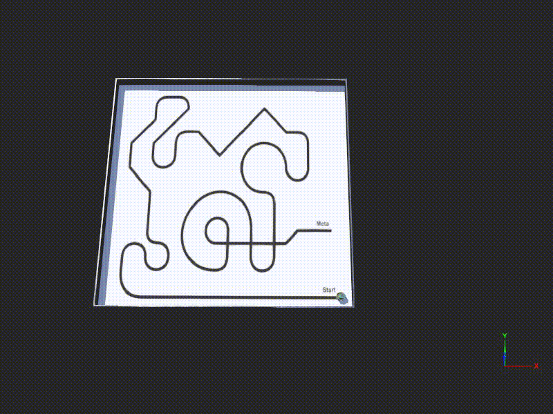

# 🏎️ High-Speed E-Puck Line Follower (Webots & OpenCV)

A high-performance autonomous line-following system using the **e-puck** robot. This project features a precision-tuned **PID controller** and leverages **OpenCV** for real-time vision processing, achieving stable navigation at 92% of the robot's hardware speed limit.

## 🚀 Performance Benchmarks (Final Results)
After extensive optimization of the PID coefficients ($K_p=0.16, K_d=0.001, K_i=0.0001$), the system achieved the following results on the standard test track:

| Metric | Result | Description |
| :--- | :--- | :--- |
| **Top Base Speed** | **5.8 rad/s** | Sustained high-speed navigation |
| **Lap Time** | **110.50 s** | Total traversal time |
| **Reliability** | **100.00%** | Zero tracking errors exceeding 100px |
| **Avg. Settling Time**| **0.853 s** | Recovery time after sharp turns |
| **Precision (IAE)** | **692.45** | Integral of Absolute Error (Lower is better) |

## 🛠️ Technical Implementation
### 👁️ Computer Vision
The robot captures a camera feed and uses **OpenCV** to:
1.  Convert the frame to Grayscale.
2.  Apply Thresholding to isolate the track.
3.  Calculate the **Line Centroid** using Image Moments ($m_{00}$ and $m_{10}$), providing a robust error signal for the controller.

### 🧠 PID Control & Stability
The controller implements a full PID loop with a specific optimization:
- **Zero-Crossing Integral Reset:** To prevent "hunting" and oscillations on straightaways, the integral term is reset whenever the error signal crosses zero. This significantly reduces the **ISE (Integral of Squared Error)** compared to standard P-controllers.


## 📁 Project Structure
- `controllers/main_controller/`: Core C++ logic, Makefile, and performance logs (`.csv`).
- `analysis/`: Python data pipeline (`analysis.py`) for generating performance reports.
- `worlds/`: Simulation environments and high-resolution track textures.
- `protos/` & `plugins/`: Robot definitions and physics plugins.

## 📊 Analytics Pipeline
The project includes a Python-based analytics suite that processes simulation data to generate professional performance reports.


**To generate a report:**
1. Ensure `pandas`, `matplotlib`, and `numpy` are installed.
2. Run the analysis script:
   ```bash
   python analysis/analysis.py

## 🏎️ Performance Demo
The GIF below demonstrates the robot maintaining a high-speed trajectory of **5.8 rad/s**. Observe the stability of the PID controller as it dampens oscillations during rapid direction changes.

<p align="center">
  
</p>