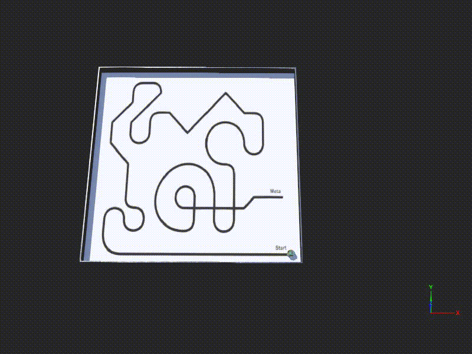

# 🏎️ High-Speed E-Puck Line Follower (Webots & OpenCV)

A high-performance autonomous line-following system using the **e-puck** robot. This version features a **Modular OOP Architecture**, a precision-tuned **PID controller**, and **OpenCV** vision processing, achieving stable navigation at high speeds.

## 🏗️ Architecture & OOP Implementation
The system has been refactored from a monolithic script into specialized C++ classes to ensure modularity and scalability:

* **EPuckLineFollowerOOP (Main):** Orchestrates the robot's lifecycle and sensor-actuator loops.
* **LineDetector:** Encapsulates OpenCV logic for grayscale thresholding and centroid calculation ($m_{00}, m_{10}$).
* **PID Controller:** Handles the control law logic, including the **Zero-Crossing Integral Reset** optimization.
* **DataLogger:** Manages real-time telemetry export to CSV for post-simulation analysis.
* **RobotState:** A lightweight structure for synchronized sensor data and error signals.

## 🚀 Performance Benchmarks (Latest Analysis)
Based on the `pidtest2_performance.csv` log, the system shows high stability even at 5.8 rad/s:

| Metric | Result | Description |
| :--- | :--- | :--- |
| **Total Traversal Time** | **114.88 s** | Total time to complete the circuit |
| **IAE (Accuracy)** | **696.62** | Integral of Absolute Error (Path following precision) |
| **ISE (Stability)** | **12246.90** | Integral of Squared Error (Reflects large oscillations) |
| **Reliability (>100px)** | **99.94%** | Success rate (only 2 peaks detected) |
| **Avg. Settling Time** | **0.878 s** | Mean time to recover stability after a curve |

---

## 🛠️ Technical Implementation & Insights

### 🧠 The Perception-Actuation Gap
A key observation in this project is that **the robot's physical center may not be perfectly aligned with the line**, even when the `LineDetector` correctly identifies the centroid in the image frame.
* **Cause:** This "lag" is due to the camera's forward placement relative to the wheel axis (look-ahead distance) and the mechanical inertia during high-speed turns.
* **Resolution:** The PID controller is tuned to prioritize stability over static alignment, using the error signal to predict the necessary angular velocity to maintain the trajectory despite this physical offset.

### ⚡ PID Control with Zero-Crossing Reset
To prevent "hunting" (oscillations) on straight segments, the integral term is reset whenever the error signal crosses zero. This maintains a low **ISE** and prevents the accumulation of error that leads to over-correction.

## 📁 Project Structure
- `controllers/EPuckLineFollowerOOP/`:
    - `LineDetector.hpp/cpp` & `PID.hpp/cpp`: Modular vision and control logic.
    - `DataLogger.hpp/cpp`: CSV Telemetry system.
    - `RobotState.hpp`: Data synchronization.
    - `EPuckLineFollowerOOP.cpp`: Main entry point.
- `analysis/`: Python pipeline for generating performance reports.

## 🏎️ Performance Demo

  

